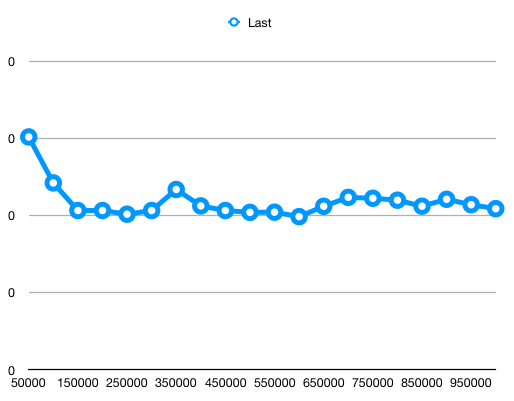
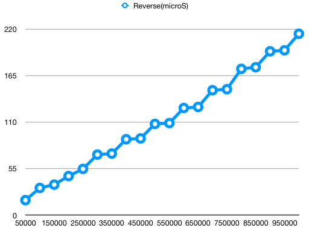
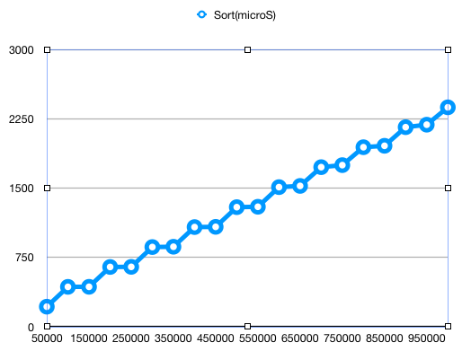
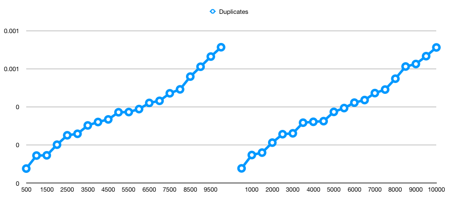

# Algorithmic-Complexity

Four .py files created to run timing scripts for standard Python functions:

* `last`
* `reverse`
* `shuffle`
* `sort`

To run, open terminal and enter
as per below:

- python filename.py

**Results for last function:**

**Results for reverse function:**

**Results for shuffle function:**

**Results for sort function:**

### Next step was to create our own functions

**Results for duplicates function:**

